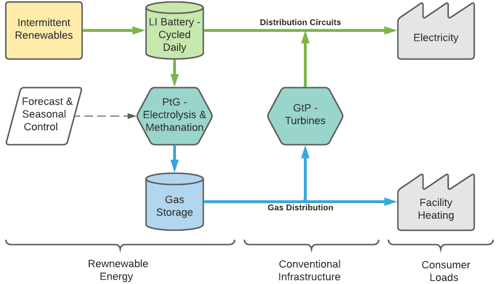

# renewable-energy-systems
Modeling, simulation, and optimization of renewable energy systems

EnergySys.m - collection of methods for simulating energy system on data with 8760 or arbitrary time resolution.
